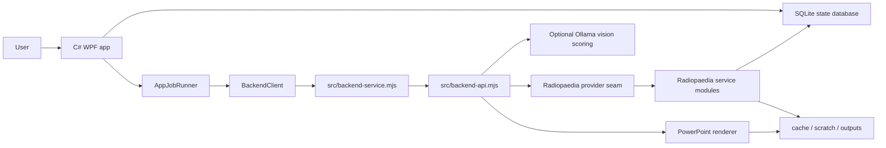
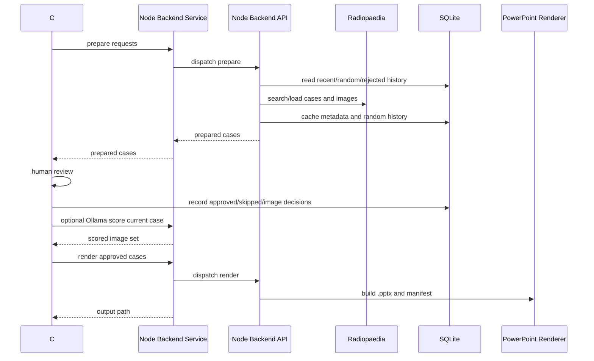

# Architecture

The app is a native Windows GUI with a Node backend. Python is no longer part of the runtime.

## Runtime Boundaries

### C# WPF

`csharp/RadiologyPpt.App` owns the desktop experience:

- request grid and dropdowns
- PowerPoint settings and presets
- review window actions
- cancellation controls
- local app settings and review/session metadata
- activity diagnostics

Long-running work is wrapped by `AppJobRunner`, which keeps the main window responsive and exposes cancellation.

### BackendClient

`BackendClient.cs` is the C# boundary to Node. It:

- starts one persistent JSONL Node backend service while the app is open
- sends prepare, score, render, Core Review, and probe jobs over stdin/stdout
- passes `RADIOLOGY_PPT_APP_ROOT`, `RADIOLOGY_PPT_RESOURCE_ROOT`, and `RADIOLOGY_PPT_DATABASE_PATH`
- parses structured backend events and sends them to the UI/activity log
- restarts or kills the Node service process on cancellation or protocol failure

The older one-shot process path remains only as a compatibility/developer fallback. Normal GUI work should use the service because review actions are much faster without repeated Node startup.

### Node Service

`src/backend-service.mjs` is intentionally small. It reads newline-delimited JSON commands, calls the workflow API, emits progress events, and returns one result or error per job.

### Node CLI

`src/cli.mjs` is intentionally thin. It parses internal command arguments and delegates to `src/backend-api.mjs`. Treat it as backend plumbing for tests, diagnostics, and developer scripts rather than a user-facing product.

### Node Backend API

`src/backend-api.mjs` is the testable workflow layer. It exports:

- request file loading and normalization
- case preparation
- match probing
- optional Ollama scoring
- PowerPoint rendering
- Core Review ingestion and quiz helpers

### Service Modules

Important Node modules:

- `src/radiopaedia-client.mjs`: HTTP, downloads, and fetch cache
- `src/providers/radiopaedia-provider.mjs`: provider seam for Radiopaedia-specific IO
- `src/radiopaedia.mjs`: search, random selection, case assembly, patient info, and image preparation
- `src/image-candidates.mjs`: image-candidate scoring and selection
- `src/focus-crop.mjs`: image focus cropping and focus-ring overlays
- `src/ollama-review.mjs`: optional local vision-model scoring
- `src/deck.mjs`: PPTX generation
- `src/app-store.mjs`: SQLite-backed backend cache, random history, and review decisions
- `src/cache-store.mjs`: compatibility layer for JSON cache fallback/backfill

## Data Flow

## Storage

The app uses one local SQLite database:

`state/radiology-ppt.sqlite`

Tables include:

- `app_settings`
- `review_sessions`
- `case_reviews`
- `image_candidates`
- `generated_powerpoints`
- `core_sources`
- `app_events`
- `schema_migrations`
- `backend_cache`
- `random_history`
- `case_decisions`
- `image_decisions`

Generated/private folders are ignored by Git:

- `cache/`
- `scratch/`
- `outputs/`
- `state/`
- `library/board-review/`
- `dist/`
- `build/`

## Cancellation

Main build/import cancellation:

- UI calls `AppJobRunner.Cancel()`
- UI calls `BackendClient.CancelCurrentProcess()`
- the active backend request is cancelled and the persistent Node service is restarted if needed

Review-window cancellation:

- review action owns its own `CancellationTokenSource`
- `Cancel Action` cancels the token and restarts the active backend service if needed
- controls are disabled during the action except the cancel button

## Performance Strategy

- Prepare multiple cases concurrently, with request order preserved.
- Keep one Node backend service alive to avoid cold-starting Node for every reroll, repick, score, or render job.
- Limit concurrent HTTP downloads and retry transient curl/Radiopaedia failures.
- Prefetch random fallback case pages in the service so rerolls have warm cache.
- Avoid repeating recent random cases by reading SQLite random history.
- Avoid skipped/rejected cases in future random pulls.
- Avoid rejected image frames when repicking images from the same case.
- Cache fetched metadata and image candidate banks.
- Store per-image audit metadata so weak selections can be debugged later.
- Keep Ollama out of initial preparation; run it only on a selected case during review.

## Database Migrations

Both C# and Node record additive schema migrations in `schema_migrations`. Prefer forward-only, additive migrations so existing local databases continue opening after app updates.

The Activity tab exposes maintenance actions for diagnostics, scratch/cache cleanup, and SQLite optimization.

## Contracts

JSON contracts live in `src/contracts`. Tests under `tests/contract-schemas.test.mjs` validate representative C# payloads and Node outputs.

When changing the C# to Node boundary, update both the schema and tests in the same commit.
