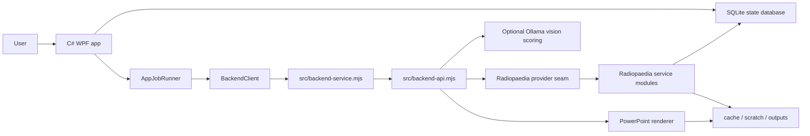
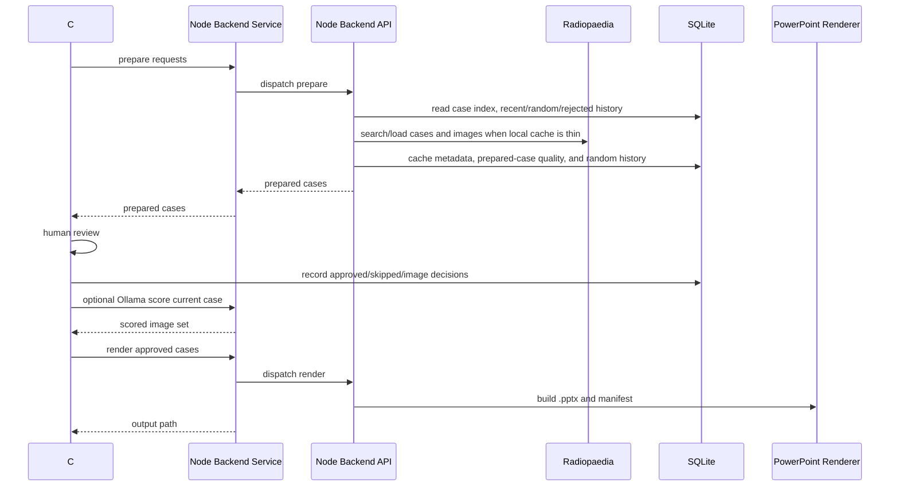

# Architecture

The app is a native Windows GUI with a Node backend. Python is no longer part of the runtime.

## Runtime Boundaries

### C# WPF

`csharp/RadiologyPpt.App` owns the desktop experience:

- request grid and dropdowns
- PowerPoint settings and presets
- review window actions
- cancellation controls
- local app settings and review/session metadata
- activity diagnostics

Long-running work is wrapped by `AppJobRunner`, which keeps the main window responsive and exposes cancellation.

The C# app is moving toward MVVM rather than putting every decision in `MainWindow.xaml.cs`:

- `MainWindowViewModel.cs` owns main-window request state, PowerPoint setting snapshots, request summaries, and prepare payload creation.
- `CaseLibraryViewModel.cs` owns the local case-library list state.
- `BackendContracts.cs` centralizes JSON payload construction and response reading at the C# to Node boundary.
- `BackendHealthMonitor.cs` periodically pings the local Node service when it is idle and restarts it with a visible status message if the service dies.

### BackendClient

`BackendClient.cs` is the C# boundary to Node. It:

- starts one persistent JSONL Node backend service while the app is open
- sends prepare, score, render, Core Review, and probe jobs over stdin/stdout
- passes `RADIOLOGY_PPT_APP_ROOT`, `RADIOLOGY_PPT_RESOURCE_ROOT`, and `RADIOLOGY_PPT_DATABASE_PATH`
- parses structured backend events and sends them to the UI/activity log
- logs long-running reminders when backend jobs keep working without returning yet
- restarts or kills the Node service process on cancellation or protocol failure
- exposes lightweight health pings for the local watchdog

The older one-shot process path remains only as a compatibility/developer fallback. Normal GUI work should use the service because review actions are much faster without repeated Node startup.

### Node Service

`src/backend-service.mjs` is intentionally small. It reads newline-delimited JSON commands, calls the workflow API, emits progress/timing events, and returns one result or error per job. The `ping` command also reports basic health metadata such as PID, uptime, handled request count, and last request time.

### Node CLI

`src/cli.mjs` is intentionally thin. It parses internal command arguments and delegates to `src/backend-api.mjs`. Treat it as backend plumbing for tests, diagnostics, and developer scripts rather than a user-facing product.

### Node Backend API

`src/backend-api.mjs` is the testable workflow layer. It exports:

- request file loading and normalization
- case preparation
- match probing
- optional Ollama scoring
- PowerPoint rendering
- Core Review ingestion and quiz helpers

### Service Modules

Important Node modules:

- `src/radiopaedia-client.mjs`: HTTP, downloads, and fetch cache
- `src/providers/radiopaedia-provider.mjs`: provider seam for Radiopaedia-specific IO
- `src/radiopaedia.mjs`: compact Radiopaedia facade that orchestrates fallback candidate attempts
- `src/radiopaedia-search.mjs`: search URL construction, search-result parsing, random selection, indexed-random reuse, and random-history expansion
- `src/radiopaedia-case-fetch.mjs`: case page loading, study/image loading, image candidate preparation, attribution metadata, and final case assembly
- `src/radiopaedia-case-text.mjs`: patient demographic extraction, intro prompts, diagnosis redaction, and teaching-point text
- `src/image-candidates.mjs`: image-candidate scoring and selection
- `src/focus-crop.mjs`: image focus cropping and focus-ring overlays
- `src/ollama-review.mjs`: optional local vision-model scoring
- `src/deck.mjs`: PPTX generation
- `src/app-store.mjs`: SQLite-backed backend cache, prepared-case index, random history, and review decisions
- `src/cache-store.mjs`: compatibility layer for JSON cache fallback/backfill

## Data Flow

## Storage

The app uses one local SQLite database:

`state/radiology-ppt.sqlite`

Tables include:

- `app_settings`
- `review_sessions`
- `case_reviews`
- `image_candidates`
- `generated_powerpoints`
- `core_sources`
- `app_events`
- `schema_migrations`
- `backend_cache`
- `case_index`
- `random_history`
- `case_decisions`
- `image_decisions`

Generated/private folders are ignored by Git:

- `cache/`
- `scratch/`
- `outputs/`
- `state/`
- `library/board-review/`
- `dist/`
- `build/`

## Cancellation

Main build/import cancellation:

- UI calls `AppJobRunner.Cancel()`
- UI calls `BackendClient.CancelCurrentProcess()`
- the active backend request is cancelled and the persistent Node service is restarted if needed

Review-window cancellation:

- review action owns its own `CancellationTokenSource`
- `Cancel Action` cancels the token and restarts the active backend service if needed
- controls are disabled during the action except the cancel button

## Performance Strategy

- Prepare multiple cases concurrently, with request order preserved.
- Keep one Node backend service alive to avoid cold-starting Node for every reroll, repick, score, or render job.
- Emit structured backend stage events with durations so slow steps can be diagnosed from the Activity log.
- Limit concurrent HTTP downloads and retry transient curl/Radiopaedia failures.
- Prefer the local prepared-case index for random requests before live Radiopaedia search.
- Prefetch random fallback case pages in the service so rerolls have warm cache.
- Avoid repeating recent random cases by reading SQLite random history.
- Avoid skipped/rejected cases in future random pulls.
- Avoid rejected image frames when repicking images from the same case.
- Cache fetched metadata and image candidate banks.
- Store prepared-case quality and filter metadata in `case_index` so repeated random runs in the same category should get faster and less repetitive.
- Store per-image audit metadata so weak selections can be debugged later.
- Keep Ollama out of initial preparation; run it only on a selected case during review.

## Database Migrations

Both C# and Node record additive schema migrations in `schema_migrations`. C# owns the desktop UI tables and Node owns backend/cache/index tables, but both record their applied schema version in the same database so local upgrades are diagnosable.

Prefer forward-only, additive migrations so existing local databases continue opening after app updates. When a table is shared across C# diagnostics and Node writes, keep the table shape aligned in both schema bootstraps so the Activity tab reflects the real backend state.

The Activity tab exposes maintenance actions for diagnostics, scratch/cache cleanup, and SQLite optimization.

## Contracts

JSON contracts live in `src/contracts`. Tests under `tests/contract-schemas.test.mjs` validate representative C# payloads and Node outputs.

When changing the C# to Node boundary, update the JSON schema, the C# helpers in `BackendContracts.cs`, and the Node contract tests in the same commit.
