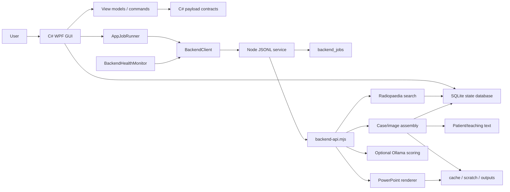
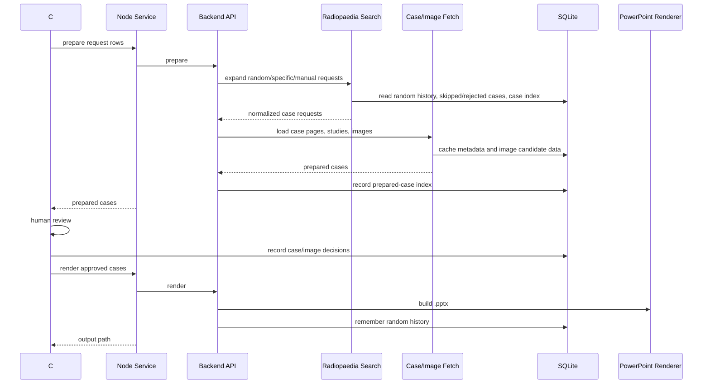

# Architecture

The app is a native Windows desktop GUI backed by a local Node service.



## Runtime Boundaries

### C# WPF App

`csharp/RadiologyPpt.App` contains the desktop app:

- tab navigation
- case request grid
- Library tab
- Core Boards source-import UI
- PowerPoint settings and presets
- review-window actions
- cancellation controls
- local app settings and review/session metadata
- activity diagnostics

The app is moving toward MVVM:

- `MainWindowViewModel.cs`: main-window request state, setting snapshots, summaries, and prepare payload creation.
- `CaseLibraryViewModel.cs`: local library state and filtering.
- `BackendContracts.cs`: centralized C# to Node JSON payload builders and response readers.
- `AppJobRunner.cs`: cancellable background jobs for prepare/render/import.
- `BackendHealthMonitor.cs`: idle-time backend pings and restart messages when the local Node service dies.

`MainWindow.xaml.cs` owns WPF event wiring. New workflow logic belongs in view models and services.

### BackendClient

`BackendClient.cs` is the C# boundary to Node. It:

- starts one persistent `src/backend-service.mjs` process while the app is open
- sends prepare, score, render, Core Boards import, and health commands over newline-delimited JSON
- passes `RADIOLOGY_PPT_APP_ROOT`, `RADIOLOGY_PPT_RESOURCE_ROOT`, and `RADIOLOGY_PPT_DATABASE_PATH`
- parses structured backend progress events into Activity log messages
- logs long-running reminders for backend work
- cancels active work by killing/restarting the service when needed
- exposes `PingAsync` for the local watchdog

### Node Service

`src/backend-service.mjs` is a small JSONL protocol wrapper. It reads one command per line, dispatches to `src/backend-api.mjs`, emits structured events, and returns one result or error per request.

The `ping` command reports basic health metadata:

- service name
- process id
- start time
- uptime
- handled request count
- last request time

Non-ping commands write durable job rows to SQLite through `src/app-store.mjs`. The Activity tab uses those rows to show recent backend command status and duration.

### Node Backend API

`src/backend-api.mjs` coordinates backend operations. It owns:

- request normalization
- case preparation
- duplicate random-case replacement
- optional Ollama scoring
- PowerPoint rendering
- random-history persistence during random-case preparation
- Core Boards source/PDF ingestion
- Core Review quiz assembly

### Radiopaedia Modules

Radiopaedia behavior is intentionally split:

- `src/radiopaedia.mjs`: small facade for preparing one case with fallback candidate attempts.
- `src/radiopaedia-search.mjs`: search URL construction, search-result parsing, random selection, local case-index reuse, exclusion handling, and random-history expansion.
- `src/radiopaedia-case-fetch.mjs`: case page validation, study loading, image candidate loading, image downloads, attribution, quality scoring, and final case assembly.
- `src/radiopaedia-case-text.mjs`: patient data extraction, intro text, redacted case prompts, and teaching-point text.
- `src/providers/radiopaedia-provider.mjs`: Radiopaedia-specific IO seam.
- `src/radiopaedia-client.mjs`: HTTP, downloads, retry/concurrency behavior, and persistent fetch cache.

### Image And PowerPoint Modules

- `src/image-candidates.mjs`: frame candidate extraction, relevance scoring, selected-image quality, and replacement rules.
- `src/ollama-review.mjs`: optional local vision-model scoring with time/image caps.
- `src/deck.mjs`: PPTX rendering.

### Core Boards Modules

- `src/core_review/schema.mjs`: ABR-style domains and question-type schema.
- `src/core_review/ingest.mjs`: text/JSON source ingestion.
- `src/core_review/pdf-ingest.mjs`: local PDF copy, page rendering, embedded-image extraction, text chunking, and provenance.
- `src/core_review/quiz.mjs`: question-bank validation, session assembly, scoring, and localization scoring.
- `src/core_review/source-bank.mjs`: imported-corpus loading, merging, and source-grounded question drafting.
- `src/core_review/index.mjs`: exports.

The GUI supports Core Boards import for PDFs, notes, and JSON study material. Backend Core Boards modules ingest source corpora, draft source-grounded questions, validate question banks, and assemble quiz sessions.

## Data Flow



## Storage

The main local SQLite database is:

```text
state\radiology-ppt.sqlite
```

Important tables:

- `app_settings`
- `review_sessions`
- `case_reviews`
- `image_candidates`
- `generated_powerpoints`
- `core_sources`
- `app_events`
- `schema_migrations`
- `app_metadata`
- `backend_cache`
- `case_index`
- `backend_jobs`
- `random_history`
- `case_decisions`
- `image_decisions`

Ignored local/private folders:

- `cache\`
- `scratch\`
- `outputs\`
- `state\`
- `review-sessions\`
- `library\board-review\`
- `dist\`
- `build\`
- `node_modules\`
- C# `bin\` and `obj\`

## Database Migrations

Both C# and Node record forward-only schema work in `schema_migrations`.

- C# owns desktop app tables and diagnostics bootstrap in `AppStorage.cs`.
- Node owns backend cache/history/index tables in `src/app-store.mjs`.
- Shared tables such as `case_index` must keep compatible schemas on both sides.
- Node records `node_schema_version` in `app_metadata`.
- C# diagnostics include migration counts and backend/cache/index table counts.
- Backend job diagnostics are additive and safe to drop/rebuild; they are for observability, not core user data.

Prefer additive migrations so existing local databases continue opening after app updates.

## Contracts

JSON schema contracts live under:

```text
src\contracts
```

Contract-related code:

- `csharp/RadiologyPpt.App/BackendContracts.cs`: C# payload builders and readers.
- `tests/contract-schemas.test.mjs`: representative schema validation.
- `src/backend-service.mjs`: runtime command envelope.
- `src/backend-api.mjs`: payload normalization and workflow execution.

When changing C# to Node fields, update schemas, C# payload contracts, backend normalization, and tests together.

Image candidates include `audit` and `selectionExplanation` fields. The audit object is machine-readable scoring/provenance; the explanation string is user-facing rationale for review and manifests.

## Cancellation And Health

Main prepare/render/import cancellation:

- UI calls `AppJobRunner.Cancel()`.
- UI calls `BackendClient.CancelCurrentProcess()`.
- The active backend service is killed and restarted on the next request.

Review-window cancellation:

- review actions own a local cancellation token
- `Cancel Action` cancels the token and kills/restarts the backend service
- review buttons are disabled during the action except cancellation

Backend health:

- `BackendHealthMonitor` pings only when no backend requests are active.
- if a health ping fails while idle, the app logs the problem and restarts the service
- if real work starts while a ping is failing, restart is deferred rather than interrupting user work

## Performance Strategy

- Keep one Node service alive while the GUI is open.
- Prepare multiple cases concurrently while preserving request order.
- Use SQLite `case_index` before live random search when possible.
- Prefer less-used and older-used indexed cases to reduce repeats.
- Avoid recently used, skipped, rejected, and currently excluded cases.
- Treat `/cases/foo` and `/cases/foo?lang=us` as the same case for exclusions.
- Cache image candidate banks and fetched metadata.
- Avoid rejected frames when re-picking images from the same case.
- Keep random fallback prefetch opt-in with `RADIOLOGY_PPT_PREFETCH_FALLBACKS=1`.
- Keep Ollama out of initial preparation; score selected cases during review only.
- Limit HTTP concurrency and retry transient Radiopaedia/curl failures.
- Emit structured progress/timing events into Activity.

See [Decision Logic](DECISION_LOGIC.md) for the random-selection, image-ranking, and storage rules.

## Packaging

Build:

```powershell
.\build-csharp-app.ps1
```

Shortcut:

```powershell
.\create-desktop-shortcut.ps1
```

Installer:

```powershell
.\build-windows-installer.ps1 -Version 0.1.0
```

The installer package is built from a self-contained Windows publish plus `src\`, `node_modules\`, `runtime\node.exe`, license/readme files, and the app icon. The installed app finds backend resources beside the executable, but writes state/cache/output data under `%LOCALAPPDATA%\RadiopaediaCasePowerPointBuilder`.

The developer packaged executable created by `build-csharp-app.ps1` lives under `dist\`, but it expects to remain inside this repository so it can find the Node backend under `src\`.
