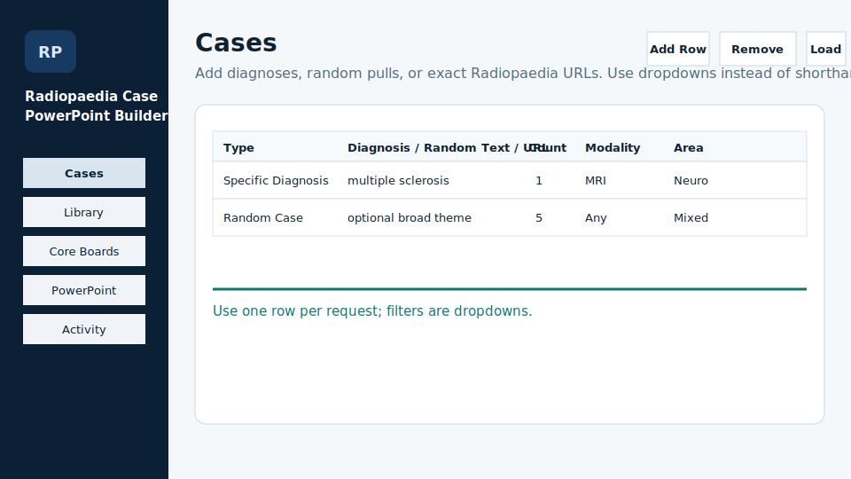
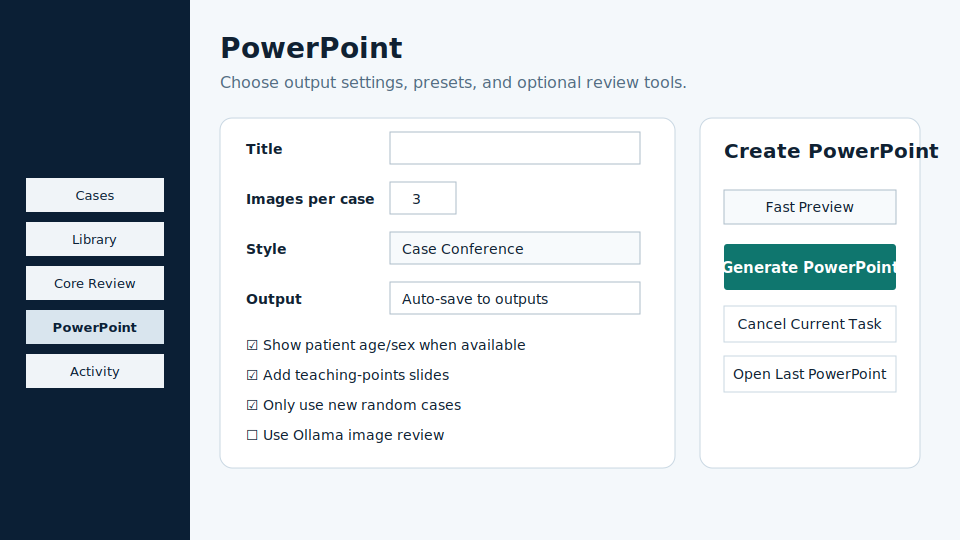
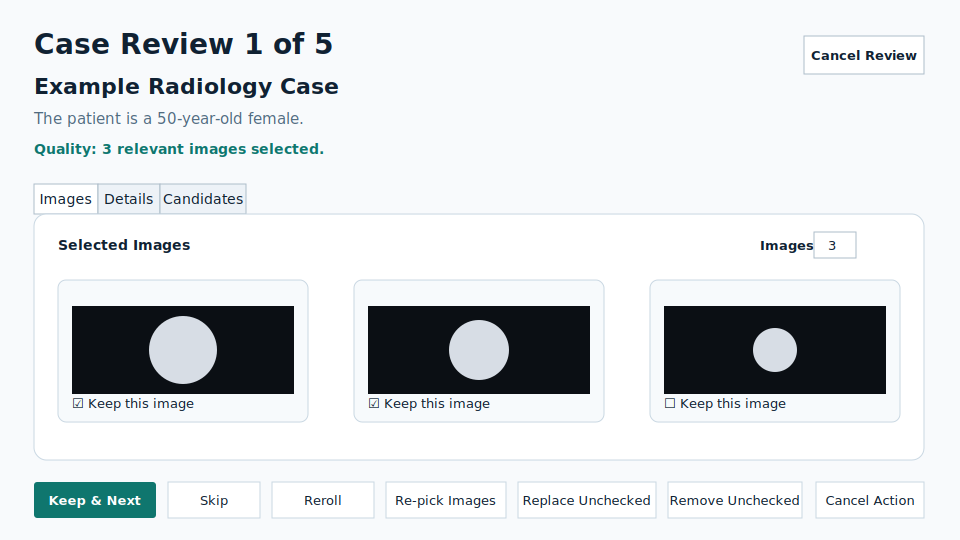

# User Guide

This app builds case-based radiology PowerPoints from Radiopaedia cases. The intended workflow is entirely through the desktop GUI.

## Quick Start

1. Open `Radiopaedia Case PowerPoint Builder` from the desktop shortcut.
2. In `Cases`, add one or more request rows.
3. In `PowerPoint`, choose a preset or adjust options manually.
4. Click `Generate PowerPoint`.
5. Review each prepared case.
6. Approve/favorite/skip/reroll cases and adjust images.
7. The app creates the PowerPoint after review.

When export finishes, there is no popup. The left status area changes, the Activity log records completion, and `Open Last PowerPoint` can open the generated file.

## Cases Tab



Use one row per request.

Request types:

- `Specific Diagnosis`: use this for named diagnoses such as `multiple sclerosis`, `appendicitis`, or `hypothalamic hamartoma`.
- `Random Case`: use this for random teaching cases. Set `Count` and optional dropdown filters.
- `Manual Case URL`: use this when you already know the exact Radiopaedia case URL or `/cases/...` path.

Useful filters:

- `Modality`: MRI, CT, X-ray, ultrasound, PET, mammography, angiography, and more.
- `Anatomy`: brain, spine, chest, abdomen, pelvis, breast, MSK regions, fetal, and more.
- `Area`: neuro, pediatrics, pediatric neuro, MSK, body, chest, cardiac, GI, GU, breast, trauma, oncology, and more.
- `Age`: adult, pediatric, neonatal.
- `Focus`: tumor, trauma, infection, vascular, congenital.
- `Difficulty`: easy, medium, hard.

Notes:

- Prefer dropdowns over typed shorthand.
- For random requests, leave the text field blank or type a broad theme if you want one.
- `Mixed` in the Area dropdown asks random mode to diversify across systems.
- Narrow filters may have a small case pool; if reroll cannot find an alternate, broaden filters or skip the case.

## Library Tab

The Library tab is local review history.

You can:

- search reviewed cases by title/path
- filter by approved, favorite, skipped, rejected, or all
- open the selected Radiopaedia case in your browser
- use favorites to find high-yield cases later

The Library is built from your local SQLite state. It is not synced to Radiopaedia or GitHub.

## Core Boards Tab

Core Boards is scaffolding for ABR Core-style study workflows.

Current GUI support:

- choose a default topic/domain
- import local PDFs
- open the private knowledge-base folder
- view import status

Imported PDFs and extracted assets stay under:

```text
library\board-review\
```

This folder is ignored by Git. Do not import copyrighted or private material unless you have the right to use it locally.

The full quiz runner, human review queue, image-localization UI, and source-grounded question workflow are future work.

## PowerPoint Tab



Main options:

- `Title`: optional. If blank, the app creates a title automatically.
- `Images per case`: target image count. Review can keep fewer when a case only has a few useful images.
- `PowerPoint style`: `Case Conference` or `Core Review`.
- `Theme`: visual style for slides.
- `Image crop`: default, tighter, or wider.
- `Image markup`: none or focus ring.
- `Output .pptx`: optional explicit output path. If blank, the app writes to `outputs\`.
- `Open PowerPoint when finished`: opens the output file after export.
- `Show patient age/sex when available`: adds minimal patient info on the case slide when clean data exists.
- `Add teaching-points slides when available`: adds teaching points after diagnosis.
- `Use Ollama image review`: enables the review-window `Ollama Score Case` action.
- `Refresh Models`: loads local Ollama model names into the model dropdown.

Presets:

- `Fast Preview`: fastest standard review.
- `Image Quality Review`: tighter crops and focus rings, no Ollama.
- `Ollama Assisted`: enables optional case-by-case Ollama scoring during review.
- `Core Review Teaching`: Core Review style with teaching points when available.
- `Dark Conference`: darker presentation style.

Buttons:

- `Generate PowerPoint`: prepare cases, show review, then create the PowerPoint after approval.
- `Cancel Current Task`: cancels prepare/render/import work.
- `Open Last PowerPoint`: opens the last generated file if it exists.
- `Open Outputs Folder`: opens generated PowerPoint outputs.
- `Open Project Folder`: opens the repository folder.

## Review Window



The review window appears after case preparation and before PowerPoint creation.

Top area:

- `Case Review N of M`: current position in the review queue.
- Case title: the Radiopaedia case currently selected.
- Patient intro: minimal age/sex context when available and enabled.
- Quality line: summary of selected image quality.
- Shortcuts: keyboard reminder.

Tabs:

- `Images`: selected images with keep checkboxes.
- `Details`: source, modality, quality warnings, and prompt text.
- `Candidates`: alternate same-case frames you can manually select.

Actions:

- `Keep Case & Next`: approve this case.
- `Favorite & Next`: approve and save as a favorite.
- `Skip Case`: reject this case and move on.
- `Reroll Case`: find a different case for the same request while excluding the current case.
- `Re-pick Images`: select a different image set from the same case.
- `Replace Unchecked`: uncheck weak images first, then replace only those slots.
- `Remove Unchecked`: uncheck weak images first, then keep fewer images.
- `Ollama Score Case`: score the current kept images if Ollama review is enabled.
- `Cancel Action`: stop a stuck reroll, re-pick, replace, or Ollama action.
- `Cancel Review`: exit review without exporting.

Keyboard shortcuts:

- `K` or `Enter`: keep case
- `F`: favorite case
- `S`: skip case
- `R`: reroll case
- `I`: re-pick images
- `Delete`: remove unchecked images
- `Esc`: cancel current action, or close review if no action is running

## Activity Tab

Use Activity when something feels slow or strange.

It shows:

- local database path and size
- cache/scratch/output sizes
- row counts for important SQLite tables
- recent app events
- backend progress/timing logs

Maintenance actions:

- `Refresh Diagnostics`: reload counts and recent events.
- `Run Maintenance`: clean old scratch/cache files and optimize SQLite.
- `Clean Scratch`: remove temporary scratch files.
- `Clean Old Cache`: remove cache files older than 30 days.
- `Open State Folder`: open the folder containing `radiology-ppt.sqlite`.

## Recommended Workflows

Fast random PowerPoint:

1. Cases: add `Random Case`.
2. Set count and optional area/modality filters.
3. PowerPoint: apply `Fast Preview`.
4. Generate, review, skip/reroll weak cases, export.

Higher-quality image PowerPoint:

1. Cases: add specific diagnoses or filtered random rows.
2. PowerPoint: apply `Image Quality Review`.
3. In review, use `Candidates` or `Replace Unchecked` for weak frames.

Ollama-assisted review:

1. PowerPoint: apply `Ollama Assisted` or enable `Use Ollama image review`.
2. Choose/refresh a local model.
3. Generate normally.
4. In review, click `Ollama Score Case` only for cases where model help is worth the wait.

Core Review style PowerPoint:

1. Cases: choose cases.
2. PowerPoint: apply `Core Review Teaching`.
3. Keep teaching points enabled.
4. Review and export.

## Local Data And Privacy

Local generated/private paths:

- `state\radiology-ppt.sqlite`
- `cache\`
- `scratch\`
- `outputs\`
- `review-sessions\`
- `library\board-review\`

These are ignored by Git. They may contain local paths, source metadata, review decisions, generated PowerPoints, imported PDF-derived data, or extracted images.

Radiopaedia images are attributed in generated slides. Keep attribution intact and follow source material terms.
